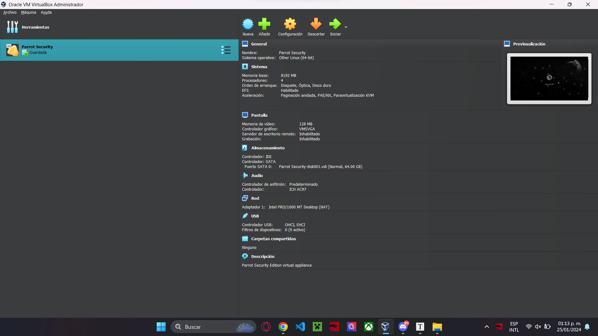
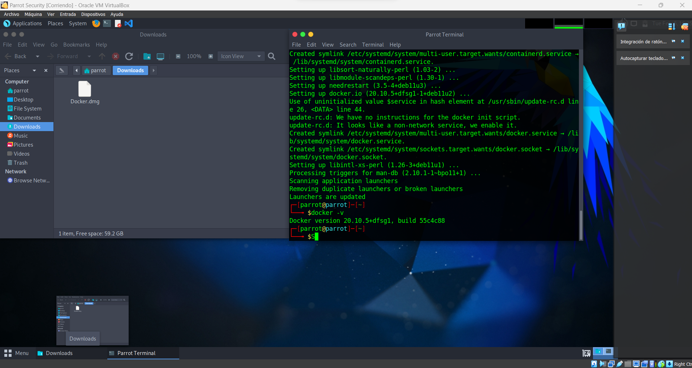
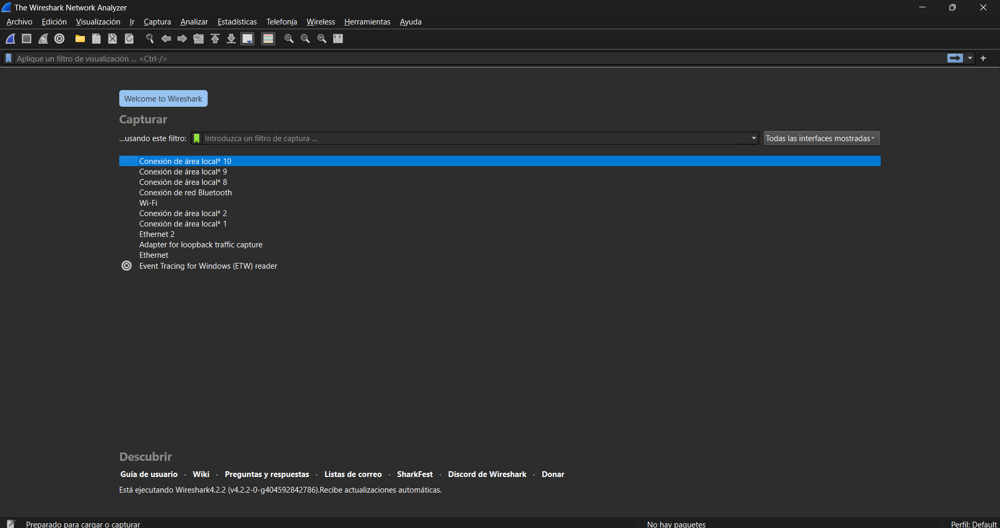

===================================================================================================

# BITACORA

===================================================================================================

                                                                                                Seguridad en datos  

                                                                                                           seccion 2 

                                                                                             Julian Azael Mex Dominguez 

                                                                                                           200300640            

                                                                                   

===================================================================================================

## Clase Juevez 19 de Enero 2024

===================================================================================================

### Tarea #995 Investigar conceptos basicos de seguridad (CIA triad, Usability triangle, riesgo, MFA, vulnerabilidad, amenaza, impacto)

* **CIA triad**
    La CIA TRIAD está conformada por las iniciales de los 3 pilares de la seguridad de la información:
  
  *  Integridad  
    La integridad se define por confiar que  los datos guardados no cambien 
  
  * Confidencialidad 
    La capacidad de controlar quien y cuando ve o tiene acceso a los datos 
  
  * Disponibilidad 
    La capacidad de tener acceso a los datos cuando se desea 
  
  
  
  * **Usability triangle**
    Es un triangulo que nos permite medir el uso de una aplicacion en proporcion a las caractrisrticas de Seguridad, Usabilidad y Funcionalidad esto dando peso a algunas a cambio de tener carencias en otras 
  
  * **MFA**
    Es un metodo más de seguridad para proteger el inicio de secion, para esto aparte de la contraseña se pide algun metodo de comprobacion externo  
  
  * **Vulnerabilidad**
    Es una debilidad o fallo que los sistemas tienen por diferentes motivos 
  
  * **Amenaza**
    Es la explotacion de una vulnerabilidad  
    
    * **Amenaza**
      Es la explotacion de una vulnerabilidad 

### Instalacion de Parrot con Virtual Box

### Instalacion de Docker en parrot

### Instalacion de Wireshark

===================================================================================================

## Clase Martes 24 de Enero 2024

===================================================================================================

**Hack vvalue**

    Es la nocion de haker de que es lo que vale la pena para obtener informacion 

**Target of evaluation**

    Es un sistema o producto con valor para el hacker

**Exploit**

    Se trata de aprovechar las  vulnerabilidades 

**Zero Day attack**

    Una vulnerabilidad del sistema que es aprobechado antes de que se pueda arreglar 

**Vulnerabullty**

    Es un punto debil del sistema donde pueden entrar

**Daisy Chaining**

es el registro de eventos de un sistema definido por  fecha, hora,usuario y que tipo de accion se ejecuto

**Non Repudiation**

    es la capacidad de un sistema de autentifica la resposabilidad de la persona en un ataque

**la negacion** 

**IDS y IPS**

 sistema de deteccion de intrusos 
 Sistema de prevencion de intrusos 

